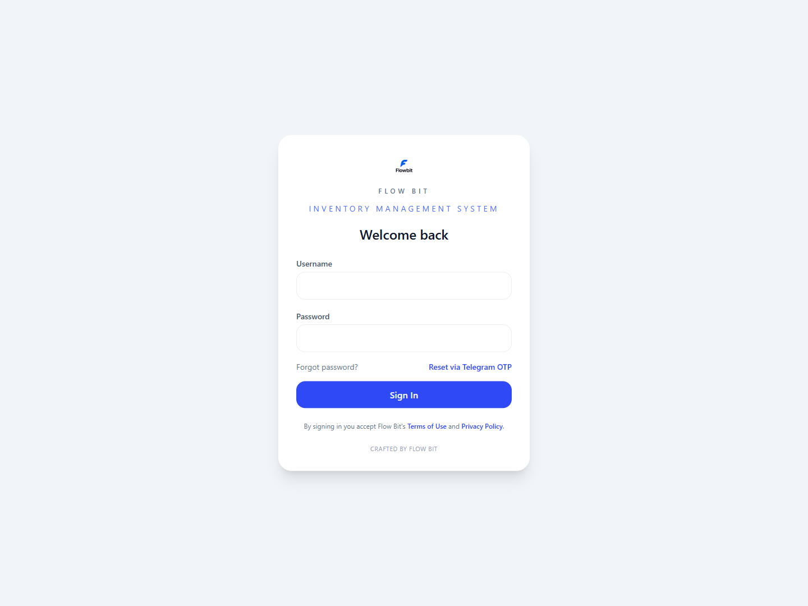
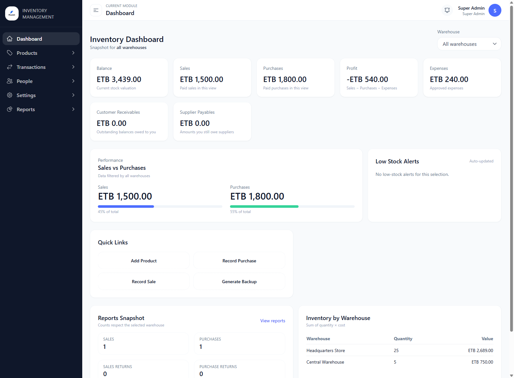
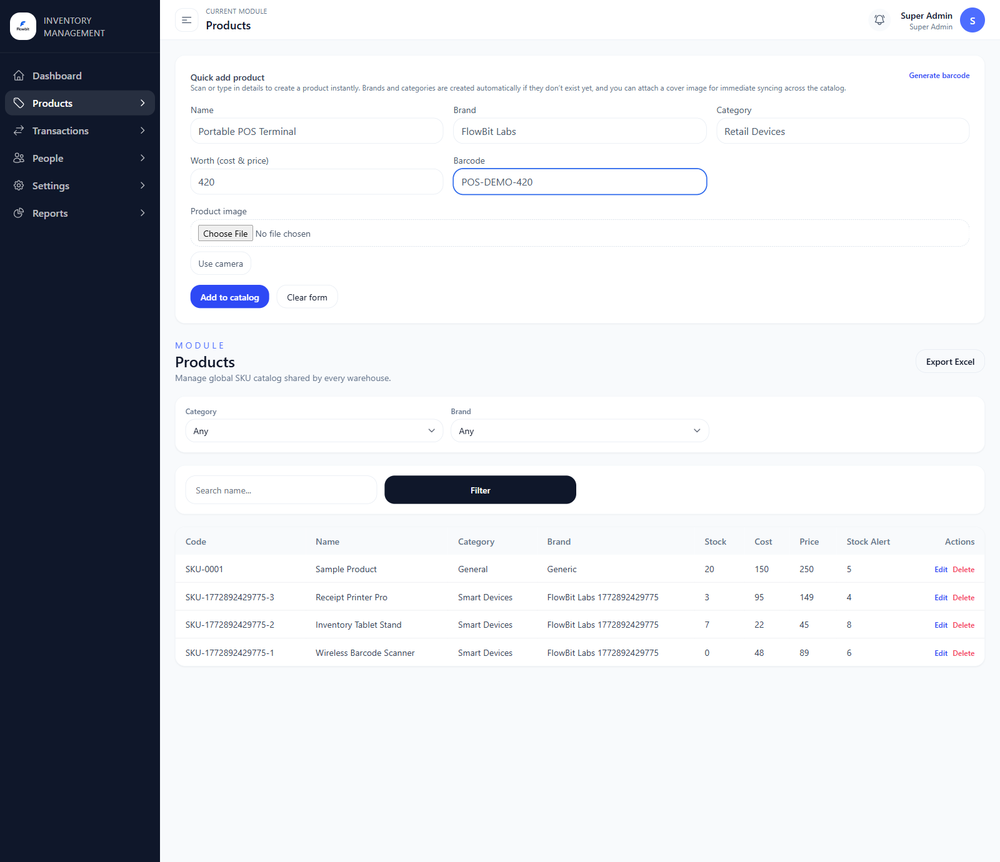
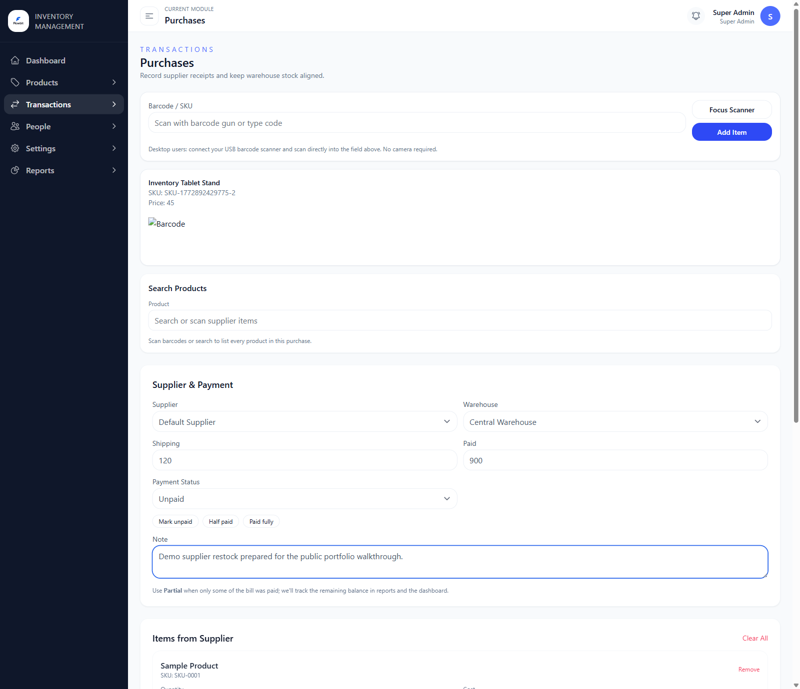
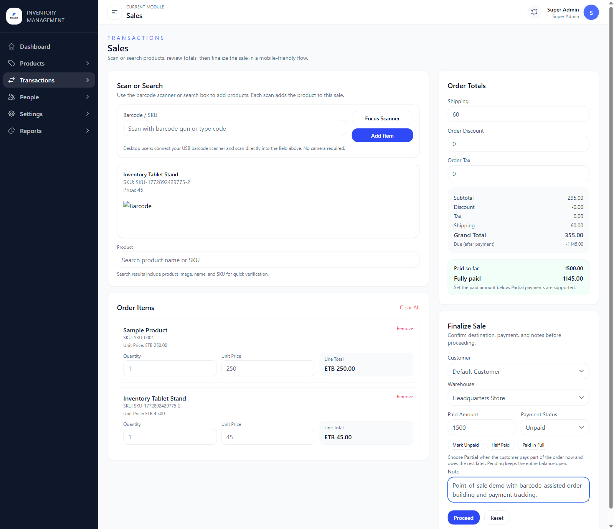
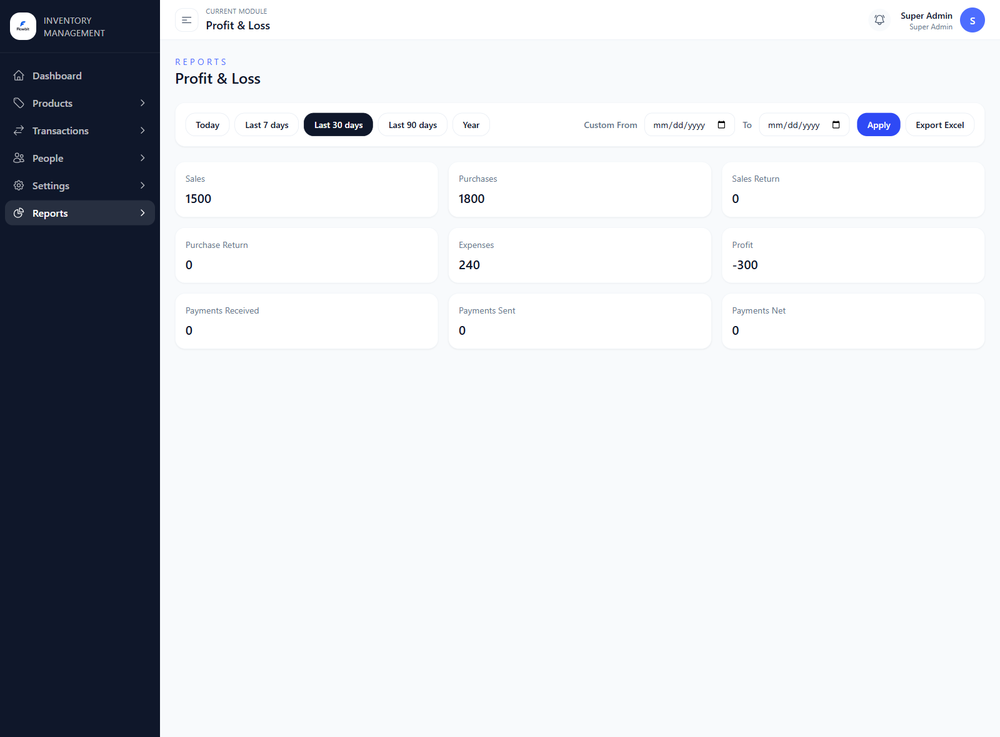
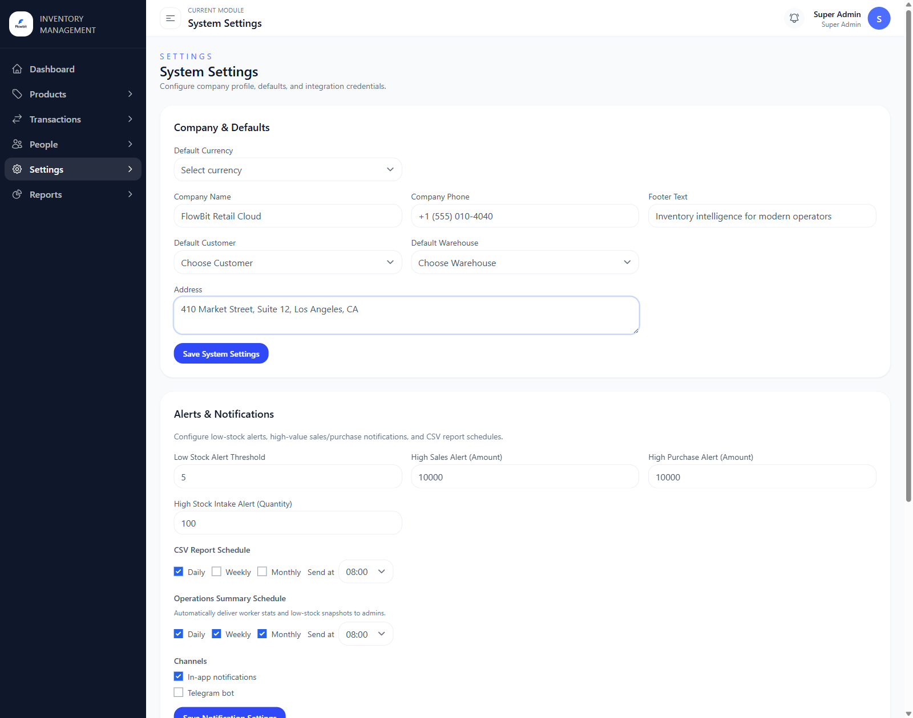
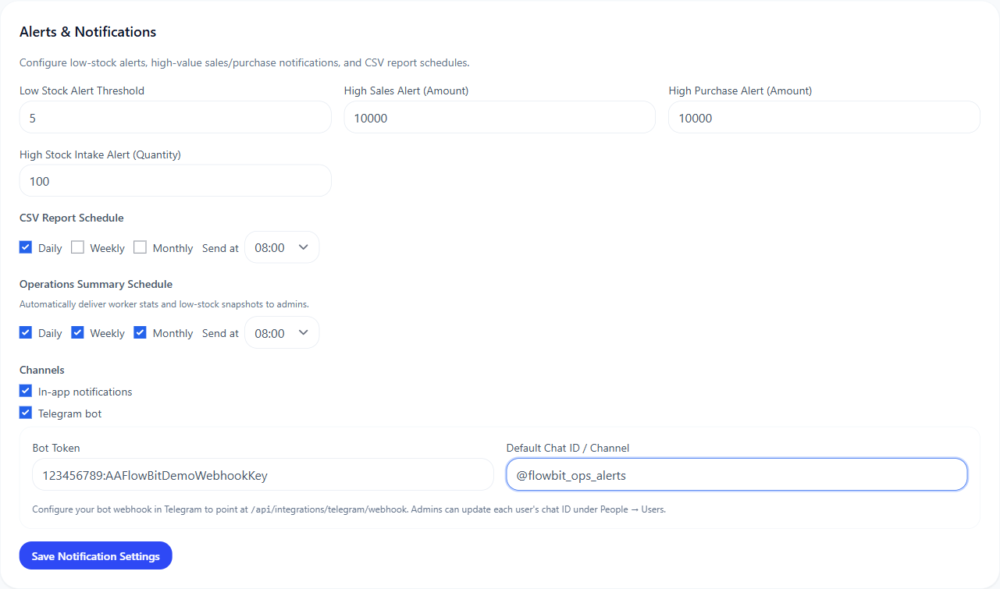

# FlowBit Inventory Platform


FlowBit is a full-stack inventory and operations platform built for multi-warehouse retail workflows. It combines a Vue 3 single-page application with an Express and Sequelize API, supports barcode-based product handling, tracks purchases and sales, manages returns and expenses, and surfaces payment and stock reports through a role-aware admin dashboard.

## Screenshots

### Login

Branded authentication screen with Flow Bit identity and Telegram OTP reset entry point.



### Dashboard

Executive overview showing inventory value, paid sales, purchases, profit impact, quick links, and warehouse summary cards.



### Product Catalog

Quick-add product workflow plus the shared SKU catalog table with category, brand, stock, and pricing data.



### Purchases

Supplier purchase entry screen with barcode/search-assisted product selection, payment fields, and line-item drafting.



### Sales

Sales workspace with product scanning/search, live order totals, payment capture, and order finalization controls.



### Reports

Profit and loss reporting view with range filters and summary cards for sales, purchases, expenses, and net performance.



### System Settings

Admin settings for company defaults, notification thresholds, scheduling, and operational preferences.



### Telegram Notifications

Telegram channel configuration for alert delivery and webhook-based notification automation.



## Product Overview

FlowBit is designed around day-to-day inventory operations:

- Central product catalog with categories, brands, units, currencies, stock alerts, and barcode generation
- Purchase and sales flows with line items, shipping, discounts, payment tracking, and warehouse-aware inventory updates
- Sales returns and purchase returns connected to original transactions
- Warehouse transfers and inventory adjustments
- Expense tracking and operational reporting
- Role and permission management for staff access
- Notification settings plus optional SMTP, Twilio, and Telegram integrations

The frontend ships a branded dashboard experience with dedicated pages for authentication, catalog management, transactions, reports, settings, legal pages, and mobile navigation. The backend exposes a structured `/api` surface with authentication, CRUD modules, reporting, exports, session management, and integration endpoints.

## Core Features

### Inventory and Catalog

- Products with categories, brands, units, currencies, pricing, stock alerts, and barcode metadata
- Inventory overview pages and warehouse-specific stock visibility
- Barcode generation and label template support
- Bulk CSV import flow for product data

### Transactions

- Purchases and sales with itemized forms
- Partial or full payment tracking
- Sales returns and purchase returns
- Inventory adjustments and warehouse transfers

### Reporting and Operations

- Profit and loss reporting
- Warehouse reporting
- Payment reporting
- Product alerts and operational summary endpoints
- Export endpoints and backup routes

### Administration

- JWT authentication with access and refresh token flows
- Silent token refresh with queued retry — failed requests replay automatically after re-auth
- Session revocation tracked server-side per-device
- Roles and granular permission seeds
- User, session, and notification settings management
- MFA-related settings and Telegram webhook support
- Auth event logging (login success, failure, logout, password reset)

## Tech Stack

| Layer | Tools |
| --- | --- |
| Frontend | Vue 3, Vue Router, Pinia, Tailwind CSS, Axios, Chart.js, Vee-Validate |
| Backend | Node.js, Express, Sequelize, PostgreSQL, Redis |
| Utilities | BullMQ, PDFKit, bwip-js, dotenv, jsonwebtoken, multer |
| Deployment | Docker, Docker Compose |
| CI | GitHub Actions |

## Architecture

### Frontend

The frontend lives in `web/` and uses Vue 3 with a Vite dev server. Route handling is defined in `web/src/router/index.js`, state is handled with Pinia stores in `web/src/stores/`, and API calls are centralized in `web/src/utils/api.js`. The Axios client implements a silent token-refresh interceptor: on a 401 response, it pauses in-flight requests, silently renews the access token via the refresh endpoint, then replays all queued requests automatically. The app includes dedicated views for dashboard metrics, authentication, inventory modules, reports, mobile layouts, settings, and legal pages.

### Backend

The backend lives in `server/` and runs an Express API mounted under `/api`. Environment parsing is centralized in `server/src/config/env.js`, route registration in `server/src/routes/index.js`, bootstrap and seed behavior in `server/src/db/bootstrap.js`, and runtime start-up in `server/src/server.js`. Storage folders under `server/storage/` are created or reused at runtime for uploads, reports, and backups.

### Data Flow

1. The Vue app sends authenticated requests to `/api`
2. Express routes apply auth and permission middleware
3. Sequelize services and controllers read or update PostgreSQL-backed models
4. Redis-backed BullMQ jobs and notification services support background operations
5. Static uploads are exposed through `/uploads`

## Repository Structure

```text
.
├── .github/workflows/ci.yml  # GitHub Actions: lint + build on every push
├── docker-compose.yml         # Full stack: Postgres, Redis, API, Web
├── README.md
├── server/
│   ├── .env.example
│   ├── Dockerfile
│   ├── package.json
│   ├── sequelize-cli-config.js
│   └── src/
│       ├── config/            # Environment and database config
│       ├── controllers/       # Route handlers
│       ├── db/                # Bootstrap, migrations, seeds
│       ├── jobs/              # BullMQ background workers
│       ├── middlewares/       # Auth, permissions, error handling, rate limit
│       ├── models/            # Sequelize models
│       ├── routes/            # Express route definitions
│       ├── services/          # Business logic layer
│       └── utils/             # Shared helpers
└── web/
    ├── .env.example
    ├── Dockerfile
    ├── index.html
    ├── package.json
    └── src/
        ├── components/        # Shared UI components
        ├── layouts/           # Dashboard and mobile layouts
        ├── router/            # Vue Router config
        ├── stores/            # Pinia state (auth, lookups, notifications)
        ├── utils/             # Axios client with refresh interceptor
        └── views/             # Page components per module
```

## One-Command Setup (Recommended)

If you have Docker installed, you can build and start the full stack (Postgres + Redis + API + Web) with:

```bash
./builder.sh up
```

To stop:

```bash
./builder.sh down
```

To reset the demo database and start fresh:

```bash
./builder.sh reset
```

To auto-generate fresh screenshots (requires a running stack):

```bash
./builder.sh screenshots
```

## Local Development

### Prerequisites

- Node.js 20 or newer
- npm
- PostgreSQL
- Redis

### 1. Configure Environment Files

Backend:

```bash
cd server
cp .env.example .env
# Edit .env — set DB_*, JWT_SECRET, JWT_REFRESH_SECRET
```

Frontend:

```bash
cd web
cp .env.example .env
```

### 2. Start the Backend

```bash
cd server
npm install
npm run dev
```

Default backend URL: `http://127.0.0.1:4000`

Health check:

```bash
curl http://127.0.0.1:4000/health
```

### 3. Start the Frontend

```bash
cd web
npm install
npm run dev
```

Default frontend URL: `http://127.0.0.1:5173`

The Vite dev server proxies `/api` requests to `VITE_PROXY_API_TARGET`, which defaults to `http://127.0.0.1:4000` in the example env file.

## Docker Setup

Run the full stack with:

```bash
./builder.sh up
```

Default service ports:

| Service | Port |
| --- | --- |
| PostgreSQL | `55432` |
| Redis | `6379` |
| API | `4000` |
| Frontend | `8080` |

The Docker Compose file already wires the frontend proxy to the backend container and provides development defaults for the database, Redis, JWT secrets, and admin password.

For demo purposes, `docker-compose.yml` enables `SEED_SAMPLE_DATA=true` so a fresh clone boots with warehouses, a sample product, and seeded permissions. Set `SEED_SAMPLE_DATA=false` in production deployments.

> **Before going live:** Replace the `JWT_SECRET` and `JWT_REFRESH_SECRET` values in `docker-compose.yml` (and your `.env`) with strong randomly generated secrets. The values shipped in this file are development defaults only.

## Default Login

The bootstrap process seeds a default admin account:

- Username: `admin`
- Password: `Admin@123`

The password can be changed through `ADMIN_DEFAULT_PASSWORD` in `server/.env`. With `ADMIN_FORCE_PASSWORD_RESET=true`, the admin is prompted to change the password on first login.

## Domain, CORS, and Telegram Setup

If you want to publish a live demo or enable Telegram notifications, configure the public domain deliberately instead of relying on local defaults.

### Recommended Domain Layout

- Frontend: `https://app.yourdomain.com`
- API: `https://api.yourdomain.com`

You can also serve both through one domain and reverse proxy `/api` to the backend.

### CORS Configuration

The backend reads `CORS_ORIGIN` from `server/.env`. It accepts comma-separated origins, and the app supports wildcard host patterns for preview tunnels or subdomain-based deployments.

```env
CORS_ORIGIN=http://localhost:5173,https://app.yourdomain.com
```

```env
CORS_ORIGIN=http://localhost:5173,https://app.yourdomain.com,https://*.trycloudflare.com
```

### Telegram Webhook Setup

Telegram needs a public HTTPS endpoint. Set these backend values in `server/.env`:

- `TELEGRAM_BOT_TOKEN`
- `TELEGRAM_CHAT_ID`
- `TELEGRAM_WEBHOOK_SECRET`

Webhook endpoint:

```text
https://your-domain.com/api/integrations/telegram/webhook
```

## Environment Variables

### Backend

- App config: `NODE_ENV`, `PORT`, `APP_TZ`, `CORS_ORIGIN`
- Database: `DB_HOST`, `DB_PORT`, `DB_NAME`, `DB_USER`, `DB_PASSWORD`, `DB_LOGGING`
- Auth: `JWT_SECRET`, `JWT_REFRESH_SECRET`, token expiry settings, admin seed password
- Redis: `REDIS_URL`
- Storage: upload and report directories
- Optional integrations: SMTP, Twilio, Telegram

### Frontend

- `VITE_API_BASE_URL` — API base path used by Axios (default: `/api`)
- `VITE_PROXY_API_TARGET` — Vite dev proxy target during local development

## API Surface Summary

The backend includes routes for:

- Authentication and password reset
- Users, roles, permissions, sessions
- Warehouses, categories, brands, units, currencies
- Products, inventory, adjustments, transfers
- Purchases, sales, returns, customers, suppliers, notes
- Payments, backups, notification settings, exports
- Reports including profit/loss, payments, warehouse, sales, purchases, customers, suppliers, and operations summary

## Security Considerations

- **JWT tokens are stored in `localStorage`**, which is the standard approach for SPAs but carries XSS risk. For hardened production deployments, consider migrating to `httpOnly` cookies with a backend-managed CSRF token.
- **Session revocation** is enforced server-side — each request validates the session record and checks for `revokedAt`. A revoked session cannot be used even with a valid JWT.
- **Refresh tokens are hashed** (bcrypt) before storage. Stolen database records cannot be used directly.
- **Rate limiting** is applied to auth endpoints via the `rateLimiter` middleware.
- **CORS** is configurable per-deployment and supports wildcard domain patterns for preview environments.
- All JWT secrets default to placeholder values. **Always set strong secrets before deployment.**

## License

MIT
